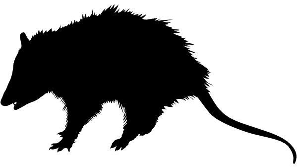

# uwin-luxury-effect

A repository that contains the data and code for:

Magle, S., Fidino, M., Sander, H., Rohnke, A. T., Larson, K. L., Gallo, T.,
Kay, C. A. M., Lehrer, E. W., Murray, M. H., Adalsteinsson, S. A., Ahlers, A. A.,
Anthonysamy, W. J. B., Gramza, A. R., Green, A. M., Jordan, M. J., Lewis, J.,
Long, R. A., MacDougall, B., Pendergast, M. E., Remine, K., Simon, K. C., Cassady
St. Clair, C., Shier, C. J., Stankowich, T., , Stevenson, C. J., Zellmer, A. J., and
Schell, C. J. (*in press*). Wealth and urbanization shape medium and large mammalian
communites across north america. Global Change Biology.

This `README` file includes information on the various scripts and datasets used for this analysis. Not every data source is saved in this repository (e.g., GIS data). The manuscript includes citation on where spatial datasets came from, and various scripts also include
urls to different spatial datasets (e.g., pulling range map information).

---

 <h3>assets</h3> 

---

This folder just contains the silhouette's used in this `README` file. There are seven of them.

---

 <h3>data</h3> 

---

There are 5 files in here, which are nested inside of a `cleaned_data` sub-folder. This extra nesting was done as we have not included the raw, pre-cleaned data used to generate the cleaned data (i.e., all the scripts make calls to `./data/cleaned_data` so we kept the nesting to ensure the scripts work). These files generally use a four-character code for each city, which are:

| City                      | Code   |
|---------------------------|--------|
| Atlanta, Georgia          | `atga` |
| Austin, Texas             | `autx` |
| Chicago, Illinois         | `chil` |
| Denver, Colorado          | `deco` |
| Edmonton, Alberta         | `edal` |
| Fort Collins, Colorado    | `foco` |
| Iowa City, Iowa           | `icia` |
| Indianapolis, Indiana     | `inin` |
| Jackson, Mississippi      | `jams` |
| Manhattan, Kansas         | `maks` |
| Madison, Wisconsin        | `mawi` |
| Orange County, California | `occa` |
| Phoenix, Arizona          | `phaz` |
| Rochester, New York       | `rony` |
| Sanford, Florida          | `safl` |
| Salt Lake City, Utah      | `scut` |
| Seattle, Washington       | `sewa` |
| Tacoma, Washington        | `tawa` |
| Wilmington, Delaware      | `wide` |

**./data/cleaned_data/covariates/cost_one_bedroom_apartment.csv:** These data were used to scaled per capita income for each city.

| Column | Type          | Description                                                                                                                                              |
|--------|---------------|----------------------------------------------------------------------------------------------------------------------------------------------------------|
| City   | Character     | The city code for a given city                                                                                                                           |
| Season | Character     | The four letter sampling period abbreviation. JA = January, AP = April, JU = July, OC = October. The numbers designate the year (e.g., 19 = 2019)        |
| Price  | Dollars (USD) | The cost of an average 1 bedroom apartment for a city during a given sampling period. See manuscript for a description of where data was collected from. |

**./data/cleaned_data/covariates/dist_city_to_species_edge.csv:** These data were used in the model to estimate if distance to edge of a species range was correlated to wheter a species was available for sampling. Negative values indicate a city was outside of a species range. The dimensions of this csv are species (n = 42) by cities (n = 20). City codes are used in place of city names (see above), while common names are used for the species. 

**./data/cleaned_data/covariates/site_covariates.csv:** This contains all the other covariate data used in the model. There are some additional covariates we thought about including, but opted to not use due to the additional model complexity (including one additional covariate added about 700 model parameters.)

| Column             | Type          | Description                                                                                                                                       |
|--------------------|---------------|---------------------------------------------------------------------------------------------------------------------------------------------------|
| Site               | Character     | The code for the site name                                                                                                                        |
| City               | Character     | The city code for a given city                                                                                                                    |
| Season             | Character     | The four letter sampling period abbreviation. JA = January, AP = April, JU = July, OC = October. The numbers designate the year (e.g., 19 = 2019) |
| Building_age       | Years         | The average building age within 1 km of a site, in years.                                                                                         |
| Impervious         | Proportion    | Percent impervious cover (0 - 100 range) within 1 km of a site.                                                                                   |
| Income             | Dollars (USD) | Per capita income within 1 km of a site.                                                                                                          |
| Ndvi               | Numeric       | Normalized vegetation difference index within 1 km of a site.                                                                                     |
| Population_density | Numeric       | Population density (people per km^2) within 1 km of a site.                                                                                       |
| Vacancy            | Numeric       | The density of vacant buildings within 1 km of a site (units per km&2).                                                                           |

**./data/cleaned_data/full_capture_history.csv:** The detection/non-detection data for the study.

| Column  | Type      | Description                                                                                                                                       |
|---------|-----------|---------------------------------------------------------------------------------------------------------------------------------------------------|
| Site    | Character | The code for the site name.                                                                                                                       |
| Long    | Longitude | Longitude of site (crs = 4326).                                                                                                                   |
| Lat     | Latitude  | Latitude of site (crs = 4326).                                                                                                                    |
| Crs     | Integer   | Coordinate reference system for the site coordinates.                                                                                             |
| Species | Character | The common-name of a given species.                                                                                                               |
| Season  | Character | The four letter sampling period abbreviation. JA = January, AP = April, JU = July, OC = October. The numbers designate the year (e.g., 19 = 2019) |
| City    | Character | The city code for a given city.                                                                                                                   |
| Y       | Integer   | The number of days the species was detected, Y <= J.                                                                                              |
| J       | Integer   | The number of days a camera was operational on a given deployment at a site.                                                                      |

**./data/cleaned_data/UWIN_site_coordinates.csv:** Coordinates for each site in the study.

| Column  | Type      | Description                                                                                                                                       |
|---------|-----------|---------------------------------------------------------------------------------------------------------------------------------------------------|
| Site    | Character | The code for the site name.                                                                                                                       |
| Long    | Longitude | Longitude of site (crs = 4326).                                                                                                                   |
| Lat     | Latitude  | Latitude of site (crs = 4326).                                                                                                                    |
| Crs     | Integer   | Coordinate reference system for the site coordinates.                                                                                             |
| City    | Character | The city code for a given city.                                                                                                                   |

---

 <h3>JAGS</h3> 

---

This contains one file, `./JAGS/multi_scale_occupancy_simpler_RE.R`, which is the Bayesian multi-city multi-species occupancy model we fit to the data.

---

 <h3>Plots</h3> 

---

This folder is basically empty (there is an `among_model` sub-folder which also has nothing). I kept these in the repository as this is the specific location that plotting scripts save their outputs.

 <h3>R</h3> 

---

**This Sub-folder contains scripts to prep data for modeling, fit the model, and plot out the results from said model**

**./R/prep_data_for_model.R:** This script reads in the cleaned data, formats it, and sets up the list object for the multi-city multi-species occupancy model that is fit in JAGS.

**./R/analysis_scripts/fit_model.R:** Fits the JAGS model, takes about 1.5 days to run.

**./R/functions/HDIofMCMC.R:** A function to calculate the 95% Highest Density Interval from the posterior.

**./R/functions/income_plot.R:** A function plot out species richness as a function of per capita income in a given city. This function is used to generate the sub-plots on the right of figure 2.

**./R/functions/make_index.R:** A function used in `prep_data_for_model.R` to create the species, site, and season index for the JAGS model.

**./R/functions/my_vioplot.R:** A modification of `vioplot::vioplot()` that looks much nicer (in my opinion) for displaying posterior distributions.

**./R/functions/order_seasons.R:** A function to take the season-year combo (e.g., `JA19` = `January, 2019`) and order them chronologically instead of alphabetically.

**./R/functions/urb_plot.R:** A function plot out species richness as a function of urban intensity in a given city. This function is used to generate the sub-plots on the right of figure 3.

**./R/plotting_scripts/graphical_abstract_plot.R:** Makes the graphical abstract plot. Assumes you have ran `./summary_scripts/species_rich_across_sites.R` and the results of that script are in your R environment.

**./R/plotting_scripts/URB_correlation_plot.R:** Makes figure 2. Assumes you have ran `./summary_scripts/species_rich_across_sites.R` and the results of that script are in your R environment.

**./R/plotting_scripts/intercept_slope_plot.R:** Makes figure 4 & 5. Assumes you have ran `./summary_scripts/species_rich_across_sites.R` and the results of that script are in your R environment.

**./R/plotting_scripts/URB_correlation_plot.R:** Makes figure 3. Assumes you have ran `./summary_scripts/species_rich_across_sites.R` and the results of that script are in your R environment.

**./R/range_map_script/pull_range_info.R:** Script to pull the distance of each city to the range edge of a given species. Uses IUCN data (url link in script).

**./R/summary_scripts/species_rich_across_sites.R:** Estimates species richness at each site from the model for 9,000 posterior draws. Also generates the correlation coefficients between species richness and income as well as species richness and urban intensity.
